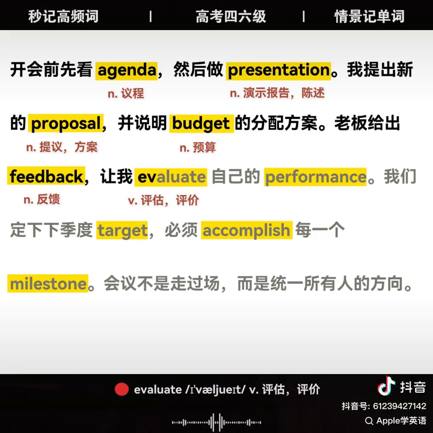
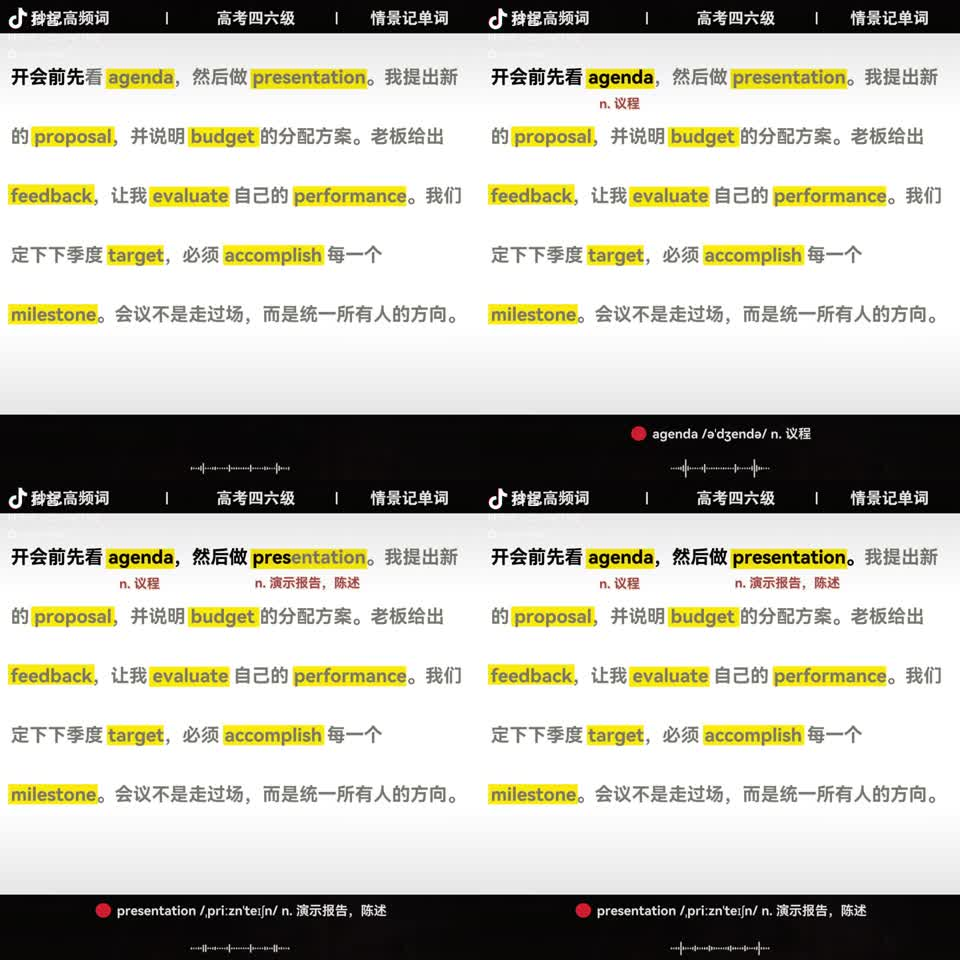
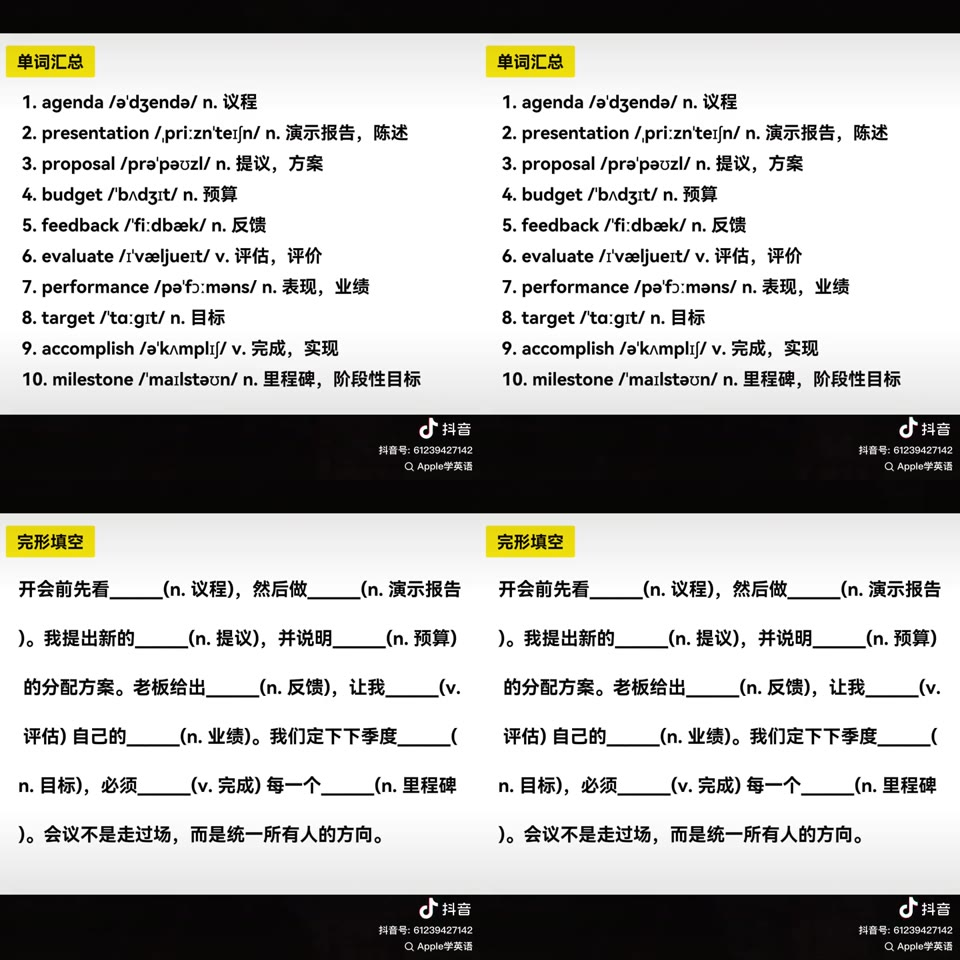
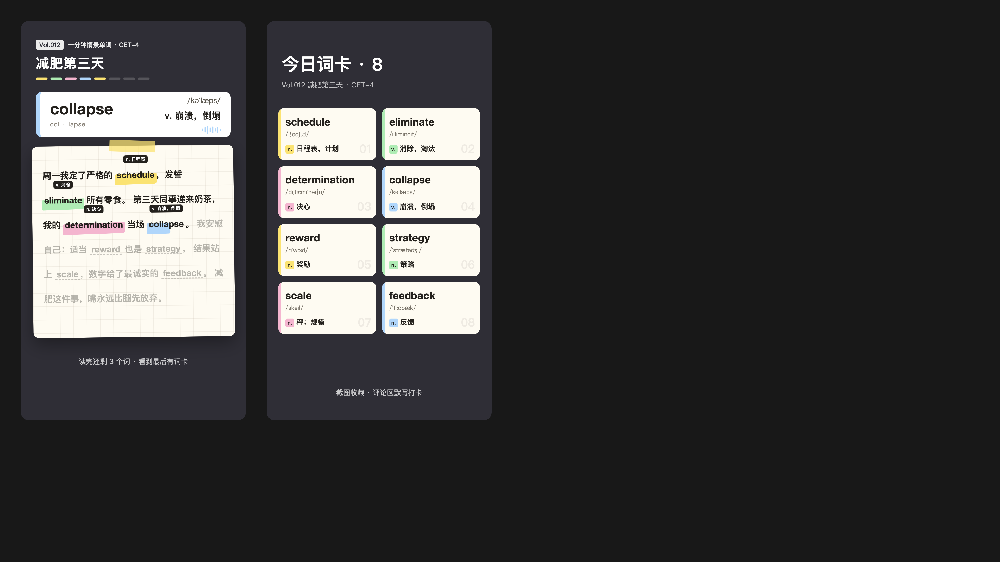

# 中英混读「情景记单词」短视频 —— 批量生产技术调研（v2：基于 Cursor 的工作流）

> 样本：`v2800fgi0000dat6lkfog65vbu1k5i00.MP4`（抖音「Apple学英语」）
> 目标：在 **Cursor 里搭一条完整工作流**，**不接入任何额外收费的大模型 API**，用「Cursor Agent 写文案 + 免费 TTS + 代码渲染」批量生产**差异化**的单词视频（只保留**朗读**和**单词汇总**两部分）。

---

## 1. 样本视频拆解

### 1.1 基本参数

| 项 | 值 |
|---|---|
| 分辨率 | 720 × 720（1:1 方形） |
| 帧率 / 编码 | 30fps，H.264 + AAC 44.1kHz |
| 总时长 | 26.6s（其中最后约 3s 是抖音下载时自动加的片尾，不属于原片） |
| 原片有效时长 | 约 23.5s |
| 文件大小 | ~1MB（码率约 300kbps，画面几乎全是静态文字，压缩率极高） |

### 1.2 时间轴（ffmpeg 场景检测 + 静音检测实测）

| 时间 | 段落 | 说明 |
|---|---|---|
| 0.0 – 19.7s | 朗读页 | 一整段中英混排短文，TTS 连续朗读，逐字高亮 |
| 20.07 – 21.6s | 单词汇总页 | 10 个单词：序号 + 单词 + 音标 + 词性 + 释义，**只停留 1.5s** |
| 21.6 – 23.57s | 完形填空页 | 原文挖空，括号提示词性 + 释义，**只停留 2s** |
| 23.57 – 26.6s | 抖音片尾 | 平台自动添加 |

汇总页和填空页停留时间很短，是有意为之：观众来不及看完，只能**暂停、截图、收藏或重刷**，这对完播率、互动和收藏数据都有利。

朗读段的语音停顿（静音 ≥ 0.25s）正好落在句号处：3.3s、6.9s、11.0s、13.5s、15.9s、19.7s。句内几乎没有停顿，英文单词和中文连读，没有单独重读或跟读。

单词出现时间（底部单词条切换时刻，实测）：

| # | 单词 | 出现时刻 | 间隔 |
|---|---|---|---|
| 1 | agenda | 1.13s | — |
| 2 | presentation | 2.47s | 1.33 |
| 3 | proposal | 4.33s | 1.87 |
| 4 | budget | 5.73s | 1.40 |
| 5 | feedback | 7.97s | 2.23 |
| 6 | evaluate | 8.97s | 1.00 |
| 7 | performance | 10.17s | 1.20 |
| 8 | target | 12.77s | 2.60 |
| 9 | accomplish | 14.17s | 1.40 |
| 10 | milestone | 15.20s | 1.03 |

大约每 **1.5s 出一个新词**，后面约 4s 是不含新词的收尾句（“会议不是走过场，而是统一所有人的方向”），作用是收束情绪、完成故事。

### 1.3 画面与动效



版式（720×720）从上到下分三块：

1. **顶部标题栏**（黑底白字，高约 50px）：`秒记高频词 | 高考四六级 | 情景记单词`，三栏均分。这是系列品牌，每期固定。
2. **正文区**（浅灰到白的渐变底）：
   - 中文约 26px 粗体，行距约 88px。行距故意留得很大，给单词下方的释义预留空间。
   - 10 个英文单词**从一开始就有黄色底块**（约 `#FFE600`），观众一眼能看到“这期学哪些词”。
   - **逐字卡拉OK高亮**：未读文字是灰色（约 `#8A8A8A`），读到的字**逐字变黑**。英文单词内部也是按字母渐进变黑（截图里 `ev|aluate` 前半黑、后半灰）。
   - 读到某个单词时，下方弹出**深红色小字释义**（如 `n. 议程`），**出现后一直保留**，读完全文时所有释义都在屏幕上。
3. **底部信息栏**（黑底，高约 100px）：
   - `● agenda /əˈdʒendə/ n. 议程`：红点 + 当前单词 + 音标 + 词性 + 释义，随朗读切换。
   - 下方是随音频跳动的声波条（音频可视化）。



结尾两页：



### 1.4 文案结构

原文（59 个汉字 + 10 个英文单词）：

> 开会前先看 **agenda**，然后做 **presentation**。我提出新的 **proposal**，并说明 **budget** 的分配方案。老板给出 **feedback**，让我 **evaluate** 自己的 **performance**。我们定下下季度 **target**，必须 **accomplish** 每一个 **milestone**。会议不是走过场，而是统一所有人的方向。

这篇文案有几个特点：

- **单一场景**（职场会议），10 个词属于同一语义场，彼此能串成一条合理的“剧情”。
- **单词都是名词或动词**，放在中文句子里语法上完全通顺（“做 presentation”“accomplish 每一个 milestone”）。避开了形容词、副词这类嵌进中文后别扭的词性。
- **释义取上下文义**而不是词典第一义项（`performance` 取“表现，业绩”）。
- **每句 1–3 个词**，密度均匀；最后一句不放词，用来收尾。
- **难度**：CET-4/6 核心词，标题里挂“高考四六级”，覆盖面最大的用户群。
- **时长**：朗读 20s 以内，完整视频约 23s。这是短视频平台完播率最友好的区间。

**可以借鉴的**：场景化小剧情、名词和动词为主、上下文释义、约 20s 的时长、结尾词卡引导截图。
**要做出差异的**：视觉风格、画幅、高亮方式、信息栏形态、结尾页设计。

---

## 2. v2 方案调整一览

| 环节 | v1（上一版） | v2（本版） |
|---|---|---|
| 文案 / 选义项 | 调用 DeepSeek、Qwen 等付费 API | **Cursor Agent 直接写**（使用 Cursor 订阅额度，不另接 API） |
| 文案质量 | 单稿生成 + 规则校验 | **9 种内容形态轮换，3 稿 + 毒舌评审子代理打分，过稿线把关**，范文库和数据回流持续迭代 |
| 流程编排 | Python 编排 + 任务队列 | **Cursor Skill + Rules + 本地 CLI 脚本**；批量时用子代理或 Cursor CLI |
| 配音 | Azure TTS（付费） | **edge-tts（免费）**为主，本地 CPU 模型兜底 |
| 对齐 | 字级对齐 | **句级 + 单词级**即可（新设计不需要逐字卡拉OK） |
| 视觉 | 复刻样本 | **全新「荧光笔手帐」风格**，竖屏 9:16 |
| 结构 | 朗读 + 汇总 + 完形填空 | **朗读 + 单词汇总** |
| 质检 | 人工抽检 | **Agent 自动抽帧“看图”质检** + 人工终审 |

本机环境：macOS、Intel x86_64、无独显、Node 20、Python 3.13、ffmpeg 已装。没有 GPU，所以**不建议在本机跑 CosyVoice 这类大型开源 TTS**（CPU 推理太慢），主力配音用 edge-tts。

---

## 3. 差异化视觉设计：「荧光笔手帐」

### 3.1 设计稿

可交互的静态稿：`design/mockup.html`（浏览器打开即可）。截图：



左图是朗读页（读到第 4 个词 `collapse`，荧光笔正在划过），右图是单词汇总页。示例文案（主题“减肥第三天”，8 个 CET-4 词）：

> 周一我定了严格的 **schedule**，发誓 **eliminate** 所有零食。第三天同事递来奶茶，我的 **determination** 当场 **collapse**。我安慰自己：适当 **reward** 也是 **strategy**。结果站上 **scale**，数字给了最诚实的 **feedback**。减肥这件事，嘴永远比腿先放弃。

### 3.2 和样本的差异

| 维度 | 样本 | 荧光笔手帐 |
|---|---|---|
| 画幅 | 720×720 方形，全屏播放时上下有黑边 | **1080×1920 竖屏**，占满手机屏幕 |
| 整体风格 | 灰白底 + 黑色条栏，偏“字幕条” | 深色背景上放一张**手帐纸**（米白网格纸、轻微倾斜、顶部胶带），像学霸笔记 |
| 单词初始状态 | 一开始就是黄底 | **虚线下划线**（先制造悬念），读到时**荧光笔从左到右划过** |
| 高亮颜色 | 统一黄色 | **黄、绿、粉、蓝 4 色轮换**，汇总页词卡用同色呼应 |
| 朗读进度 | 逐字由灰变黑 | **按句聚焦**：已读和正在读的句子为实色，未读句子是 32% 透明度 |
| 释义位置 | 单词**下方**红色小字 | 单词**上方**黑底白字小标签（贴纸感） |
| 当前单词信息 | 底部黑条一行字 | 顶部**大号聚焦词卡**：单词、**音节拆分**（`col · lapse`）、音标、释义、声波，左侧色条和荧光笔同色 |
| 进度提示 | 无 | 标题下方 **N 格进度条**，每学一个词点亮一格 |
| 系列感 | 固定标题栏 | `Vol.012` 期号 + 系列名 + **每期一个大标题**（场景名） |
| 结尾 | 汇总 1.5s + 完形填空 2s | 只保留**「今日词卡」双列卡片墙**，约 4s，卡片依次弹入，底部提示“截图收藏 · 评论区默写打卡” |

### 3.3 画面规格与安全区

- 1080×1920，30fps，H.264（CRF 20–23），AAC 128kbps。
- **抖音、小红书全屏播放时，底部约 400px 会被标题和文案遮挡，右侧约 120px 有点赞、评论图标**。所以关键信息都放在 y=90–1520 之间，底部只放不重要的引导文字。
- 纵向布局（px）：
  - 90–300：期号、系列名、主题大标题、进度条。
  - 340–560：聚焦词卡。
  - 600–1520：手帐纸正文。
  - 1520 以下：留白，放引导文字。

### 3.4 分镜时间轴（约 24s）

| 时间 | 场景 | 画面 | 声音 |
|---|---|---|---|
| 0 – 0.6s | 朗读页入场 | 纸张从下方滑入并落定（spring），标题淡入；聚焦词卡显示“今天 8 个词，读完测你” | 轻快的 BGM 起 |
| 0.6 – ~19s | 朗读 | 按句聚焦；每读到一个单词：荧光笔划过、上方弹出释义标签、聚焦词卡切换、进度条点亮一格 | TTS 朗读，BGM 压到 -28dB |
| ~19 – 19.4s | 转场 | 纸张向左翻走 | “唰”的翻页音效 |
| 19.4 – ~24s | 今日词卡 | 标题出现，8 张卡片每隔 80ms 依次弹入，停留约 3s | “叮”一声，BGM 收尾 |

可选变体：汇总页用英文语音快速把 8 个词读一遍（每个约 0.6s，汇总页会延长到约 6s）。这个变体用 A/B 测试看完播率再决定是否采用。

### 3.5 动效规范

| 元素 | 触发 | 动画 |
|---|---|---|
| 句子聚焦 | 句子开始时刻 | 透明度 0.32 → 1，200ms |
| 荧光笔 | 单词开始时刻 | `scaleX` 0 → 1，时长 = 单词发音时长（最少 250ms），ease-out；笔触轻微倾斜 -1.5°，圆角不规则 |
| 释义标签 | 单词开始 +80ms | spring 缩放 0.6 → 1，同时上移 6px，之后常驻 |
| 聚焦词卡 | 单词开始时刻 | 旧词卡上滑淡出、新词卡由下滑入（180ms），色条换成当前词的颜色 |
| 声波 | 持续 | 按音频振幅画 8–12 根竖条 |
| 进度条 | 单词开始时刻 | 对应格子由暗变为当前词的颜色 |
| 词卡墙 | 汇总开始 | 每张卡片 `translateY 40px → 0` 加淡入，依次间隔 80ms |

### 3.6 配色与字体

- 背景 `#2B2A33`，纸张 `#FFFBF2` 加 64px 淡网格，墨色 `#1F1B16`。
- 荧光笔四色：黄 `#FFE45C`、绿 `#9EF0B0`、粉 `#FFB3D1`、蓝 `#A9D8FF`。
- 中文字体：**思源黑体 / Noto Sans SC**（Bold、Heavy，OFL 可商用）。英文：**Poppins ExtraBold**（OFL）。**不要用苹方、微软雅黑**，有商用授权风险。设计稿里用的是系统字体，只作示意。
- 排版细节：单词和它后面紧跟的标点要**绑成一个不可断开的单元**，避免句号落到行首（设计稿里还能看到这个问题）。

### 3.7 这个设计顺带降低了技术难度

样本的逐字卡拉OK需要**字级时间戳**，对齐稍有偏差就会“字和声音对不上”。新设计只需要两种时间：

1. **每句的开始和结束**：分句合成时直接得到，100% 精确。
2. **每个单词的开始和结束**：edge-tts 的 WordBoundary 事件直接给出。

这两种时间都容易拿到而且很稳，**不需要强制对齐模型**。这是选择按句聚焦加荧光笔方案的重要原因。

---

## 4. 内容策划：让每一篇都值得看完

视觉和技术决定“能不能批量做”，**文案决定“有没有人看、有没有人转”**。目标是每一篇都**新颖、有趣、贴近生活、带点调侃**，形式可以灵活，但质量必须稳定。下面把这个要求拆成 Agent 能执行、脚本能检查的规则。

### 4.1 好文案的四个标准

1. **3 秒钩子**：第一句就要有画面或冲突（“周一闹钟响了五遍”），不能是铺垫或背景介绍。
2. **共鸣**：写大多数人都经历过的事，比如周一、挤地铁、减肥、双十一、被催婚、租房、考试周。听完会心一笑，觉得“这说的就是我”。
3. **反转收尾**：最后一句不放单词，要做到意料之外、情理之中，用自嘲、反差或金句收住，并且**不解释笑点**。
4. **单词是剧情的关键**：目标单词放在推动剧情或抖包袱的位置，而不是可有可无的修饰。单词和场景绑得越紧，越容易记住（比如“我的 determination 当场 collapse”）。

### 4.2 内容形态库（不必只写“小故事”）

同一组单词可以用完全不同的形态来写。形态轮换是保持新鲜感的最简单手段。

| 形态 | 写法 | 适合的主题 |
|---|---|---|
| 吐槽小剧场 | 第一人称，铺垫、升级、反转 | 打工、上学、减肥、租房 |
| 朋友圈 vs 现实 | 前半段“朋友圈”，后半段“现实”，靠反差出笑点 | 旅行、健身、做饭、恋爱 |
| 伪官方通知 | 一本正经地发“声明”“通知”，内容荒诞 | 双十一、新年计划、开学 |
| 灵魂拷问对话 | “我说……她问……”来回几轮，最后一句破防 | 妈妈、老板、相亲对象、房东 |
| 拟人视角 | 用猫、狗、闹钟、体重秤、外卖的口吻写人类 | 宠物、日常物品 |
| 反鸡汤 | 先摆出励志开头，最后被现实打脸 | 自律、早起、学习计划 |
| 伪新闻 / 天气预报 | 播报腔，讲生活琐事 | 堵车、放假、降温 |
| 说明书 / 招聘启事 / 菜谱体 | 借用固定文体来写荒诞内容 | 室友、男朋友、周末 |
| 节日热点 | 结合当周节日和话题 | 国庆、中秋、考研、毕业季、世界杯 |

**栏目化**：每个形态可以做成固定栏目，比如周一“打工人英语”、周三“猫主子英语”、周五“朋友圈 vs 现实”。观众会形成期待，账号辨识度也更高。

### 4.3 写作技巧清单

- **具体胜过笼统**：写“闹钟响了五遍”，不写“起不来”；写“三包纸巾”，不写“一些东西”。
- **数字制造画面**：两个小时的会、多花两百、一万个后脑勺。
- **短句、口语**：读出来要像朋友聊天，不像课文；每句不超过 25 个字。
- **三段节奏**：铺垫、升级、反转。前面越认真，结尾的反差越好笑。
- **调侃的分寸**：**自嘲优先**；可以调侃普遍现象（周一、堵车、购物车），**不调侃具体人群**（地域、性别、职业、外貌、疾病）。
- **收尾句不超过 15 个字**，读完可以留 0.3 秒停顿让笑点落地。

### 4.4 示范文案

下面 6 篇示范了不同形态，单词都是 CET-4 常见的名词和动词，每篇 4–7 个词。（实测 edge-tts 语速 +5% 时约每秒 3.3 个汉字，**正式文案要控制在 45–62 个汉字**；下面几篇略长，用作形态示范。）

**① 吐槽小剧场 · 周一**

> 周一闹钟响了五遍，我的 **motivation** 还在被窝里 **negotiate**。地铁挤得像一场 **competition**，我全程被 **compress** 成一张照片。老板说要提高 **efficiency**，于是 **schedule** 了一个两小时的会，主题是“拒绝无效会议”。散会一看表，正好下班。

**② 拟人视角 · 猫主子**

> 我是一只猫，每天的 **routine** 很简单。早上五点，我准时 **inspect** 铲屎官的脸。他假装 **ignore** 我，我就把水杯 **push** 下桌。他终于起床，给了我一根猫条当 **reward**。人类真好教，三天就学会了。

**③ 伪官方通知 · 双十一**

> 本人郑重 **announce**：今年双十一绝不乱 **purchase**。经过冷静 **analysis**，购物车里全是生活 **necessity**。为了凑满减 **discount**，我又加了三包纸巾。结账时瞄了一眼 **budget**，比去年多花两百。明年的声明，今年先写好了。

**④ 朋友圈 vs 现实 · 国庆**

> 朋友圈：国庆 **escape** 城市，去山里 **explore** 大自然。现实：车在高速上 **crawl** 了六个小时，服务区排队全靠 **patience**。景区最美的 **scenery**，是一万个后脑勺。回家把照片 **edit** 了一整晚。配文：人少景美，强烈推荐。

**⑤ 灵魂拷问对话 · 妈妈**

> 我说想 **apply** 一份新工作，我妈问：稳定吗？我说 **salary** 能翻倍，她问：有编制吗？我说能 **develop** 自己，她问：离家近吗？最后我做出了 **compromise**。现在我在楼下超市收银，我妈逢人就夸。

**⑥ 反鸡汤 · 早起**

> 网上说成功靠 **discipline**，我决定每天五点起床。第一天，我 **achieve** 了人生第一次看日出。第二天，我把计划 **adjust** 成了六点。第三天闹钟响的时候，我终于 **realize** 了一个道理。早起的鸟儿有虫吃，可我又不是鸟。

### 4.5 质量评分表（毒舌评审用）

每一稿按 6 个维度打 1–5 分：

| 维度 | 5 分的样子 | 1 分的样子 |
|---|---|---|
| 钩子 | 第一句就想听下去 | 背景介绍、流水账开头 |
| 共鸣 | “这不就是我” | 小众、离普通人太远 |
| 笑点 / 反转 | 结尾让人笑出声或想转发 | 平铺直叙，或者硬讲道理 |
| 新鲜度 | 角度没见过，没用烂梗 | 和往期雷同，满是网络老梗 |
| 单词自然度 | 单词在关键位置，替换得很顺 | 硬塞进去，换回中文反而更顺 |
| 准确性 | 用法、释义、常识都正确 | 有用法错误或事实错误 |

**过稿线**：总分 ≥ 24/30，所有单项 ≥ 3，**钩子和笑点这两项必须 ≥ 4**。

### 4.6 禁忌清单

- **说明文 / 流水账**：“小明去超市买东西，他先……然后……”
- **强行塞词**：把单词换回中文后句子反而更自然，说明塞得太硬。
- **说教和鸡汤**：结尾喊口号、讲大道理。
- **烂梗**：yyds、绝绝子、家人们谁懂啊，以及内卷、躺平的滥用。这些词维护在 `data/banned_phrases.txt`，由脚本自动拦截。
- **冒犯**：地域、性别、职业、外貌、疾病相关的调侃；真实人名；品牌负面；政治；灾难事故。
- **解释笑点**：“哈哈，是不是很真实？”之类。
- **常识错误**：Agent 写完要自查。

### 4.7 在 Cursor 里怎么保证每篇都达标

1. **选题**：从 `data/themes.yaml` 选题库里挑；每周让 Agent 用 Cursor 内置的**网页搜索**看一眼近期节日和热点，补充时令选题。
2. **一组词写 3 稿，用 3 种不同形态**（比如吐槽、对话、伪通知），避免 Agent 总写成同一种套路。
3. **毒舌评审子代理**：单独开一个子代理，按 4.5 的评分表打分，并指出每稿最弱的一句。评审用独立上下文，避免“自己写的自己打高分”。
4. **选最高分那稿精修一轮，再评一次**；不达标就换形态重写，3 轮都不过就换选题或换词。
5. **去重**：定稿追加到 `data/published_scripts.md`。评审时带上最近 30 期的主题和结尾句，防止重复。
6. **范文库**：`data/hall_of_fame.md` 存放表现最好的文案（初始放 4.4 的示范），写稿时作为参考范例。
7. **数据回流**：发布 3 天后记录完播率、点赞、收藏到 `progress.db`。每两周让 Agent 分析哪些形态和主题表现好，更新范文库和形态轮换比例。

---

## 5. 基于 Cursor 的工作流

### 5.1 分工原则

- **Cursor Agent 负责需要“判断力”的部分**：选题、写文案、从词典候选里挑上下文义项、看校验报告自己改稿、看渲染抽帧判断画面有没有问题。
- **本地脚本负责确定性的部分**：查词库、校验、TTS、时间轴计算、渲染、抽帧。Agent 只负责调用脚本和读结果。
- 这样 Agent 的 token 只花在写文案和判断上，Cursor 额度消耗小，流程也可复现。

### 5.2 流程

```
你在 Cursor 里说：「做 3 期 CET-4，主题：减肥、租房、面试」
        │
        ▼
┌─ Cursor Agent（按 Skill: vocab-video 执行）────────────────────────────┐
│ ① vv plan  --level cet4 --n 8 --theme 减肥      → 候选词 + ECDICT 义项    │  脚本
│ ② 写 episodes/012/script.json（选词、文案、选义项）                     │  Agent
│ ③ vv validate episodes/012                     → 校验报告               │  脚本
│    └ 不通过 → Agent 按报告修改 → 回到 ③（最多 3 轮）                     │  Agent
│ ④ vv tts episodes/012                          → audio.mp3 + timeline.json │ 脚本（edge-tts）
│ ⑤ vv qa-audio episodes/012                     → 时长、静音检查           │  脚本
│ ⑥ vv render episodes/012                       → out.mp4                │  脚本（Remotion）
│ ⑦ vv frames episodes/012                       → 抽 4 张关键帧           │  脚本
│ ⑧ Agent 读取关键帧图片做视觉质检（溢出、遮挡、错字、错位）                │  Agent
│ ⑨ vv commit episodes/012                       → 写入已用词记录          │  脚本
└──────────────────────────────────────────────────────────────────────┘
        │
        ▼
人工终审（看 out.mp4）→ 手动上传发布
```

### 5.3 用到的 Cursor 能力

| 能力 | 在本工作流中的用途 |
|---|---|
| **Agent（对话）** | 核心执行者：写文案，调用脚本，读报告和图片 |
| **项目 Skill**（`.cursor/skills/vocab-video/SKILL.md`） | 把上面 ①–⑨ 的步骤、命令和判断标准固化下来，说“做 N 期视频”就自动按流程走 |
| **项目 Rules**（`.cursor/rules/*.mdc`） | 文案规范（字数、词性、句式、风格、禁忌），编辑 `script.json` 时自动生效 |
| **AGENTS.md** | 项目说明：目录结构、CLI 命令、数据文件位置 |
| **子代理（Task）** | 批量时让多个子代理**并行写文案**（每个负责一期），主 Agent 汇总后串行跑 TTS 和渲染 |
| **Hooks**（`.cursor/hooks.json`） | `afterFileEdit` 时自动跑 `vv validate`，Agent 一改完就拿到校验结果 |
| **读图能力** | 抽帧后 Agent 直接看 PNG，检查文字溢出、标签重叠、颜色异常 |
| **内置浏览器** | 打开 Remotion Studio（`localhost:3000`）预览、截图、调样式 |
| **Cursor CLI**（`cursor-agent -p "..."`，非交互模式） | 无人值守批量：shell 循环或 crontab 每天定时生成 N 期（参数以 `cursor-agent --help` 为准） |
| Automations / Cloud Agents（可选） | 云端定时触发；但云端环境要能装 edge-tts、Node 和 Chrome，**起步建议只在本地跑** |

**额度说明**：“不接收费 API”指的是不额外对接其他大模型厂商；Agent 写文案会消耗 **Cursor 订阅的用量**。一期文案加改稿大约是几千 token 的量级，日产几十期没有压力。批量时可以选择更便宜或更快的模型（如 Composer、Auto），关键期再用强模型。

### 5.4 项目结构

```
英语/
├── AGENTS.md                          # 项目说明（给 Agent 看）
├── .cursor/
│   ├── skills/vocab-video/SKILL.md    # 工作流 Skill
│   ├── rules/copywriting.mdc          # 文案规范（globs: episodes/**/script.json）
│   ├── hooks.json                     # afterFileEdit → 自动校验
│   └── hooks/validate-script.sh
├── data/
│   ├── ecdict.db                      # ECDICT 转成的 SQLite
│   ├── themes.yaml                    # 选题库（场景列表）
│   ├── hall_of_fame.md                # 范文库（写稿参考）
│   ├── published_scripts.md           # 已发布文案（去重、新鲜度检查）
│   ├── banned_phrases.txt             # 烂梗和敏感词黑名单
│   └── progress.db                    # 已用词、期号、发布记录、播放数据
├── pipeline/                          # Python CLI：vv
│   ├── cli.py                         # plan / validate / tts / qa-audio / frames / commit
│   ├── lexicon.py                     # 查词、义项候选、音节拆分（pyphen）
│   ├── validate.py
│   ├── tts_edge.py                    # edge-tts 分句合成 + WordBoundary
│   └── timeline.py                    # 生成 timeline.json
├── video/                             # Remotion 工程
│   ├── src/Root.tsx
│   ├── src/MarkerNotes/Reading.tsx
│   ├── src/MarkerNotes/Summary.tsx
│   └── public/fonts/ bgm/ sfx/
├── episodes/
│   └── 012/
│       ├── drafts.md                  # 3 份候选稿 + 评审打分
│       ├── script.json                # Agent 产出（定稿）
│       ├── report.json                # 校验报告
│       ├── audio.mp3  timeline.json   # TTS 产出
│       ├── out.mp4  cover.png
│       └── frames/*.png               # 质检抽帧
└── design/mockup.html                 # 设计稿
```

### 5.5 `script.json`（Agent 唯一需要写的文件）

```json
{
  "id": "012",
  "series": "一分钟情景单词",
  "level": "CET-4",
  "theme": "减肥第三天",
  "genre": "吐槽小剧场",
  "review": {"hook": 4, "relatable": 5, "punchline": 4, "fresh": 4, "natural": 5, "accurate": 5, "total": 27},
  "sentences": [
    [{"t": "周一我定了严格的"}, {"w": "schedule"}, {"t": "，发誓"}, {"w": "eliminate"}, {"t": "所有零食。"}],
    [{"t": "第三天同事递来奶茶，我的"}, {"w": "determination"}, {"t": "当场"}, {"w": "collapse"}, {"t": "。"}],
    [{"t": "减肥这件事，嘴永远比腿先放弃。"}]
  ],
  "words": [
    {"word": "schedule", "pos": "n.", "meaning": "日程表，计划"},
    {"word": "collapse", "pos": "v.", "meaning": "崩溃，倒塌"}
  ]
}
```

音标、音节拆分、颜色分配都由脚本补全，不需要 Agent 填，也不应该让 Agent 填。

### 5.6 Skill 草稿：`.cursor/skills/vocab-video/SKILL.md`

```markdown
---
name: vocab-video
description: 批量生产「荧光笔手帐」中英混读单词短视频。当用户说"做 N 期视频""生成单词视频""出一期 CET-4/考研/雅思"时使用。
---
# 单词视频生产流程

## 每一期的步骤
1. 取候选词：`vv plan --level <cet4|cet6|ky|ielts> --n 8 --theme "<主题>"`
   输出候选词及每个词的 ECDICT 义项；已用过的词会自动排除，并混入 2 个到期复习词。
2. 写稿（遵守 `.cursor/rules/copywriting.mdc`，参考 `data/hall_of_fame.md`）：
   - 用 3 种**不同形态**各写一稿，存进 `episodes/<id>/drafts.md`。
   - 开一个**毒舌评审子代理**，给它 3 份稿、评分表和最近 30 期的主题及结尾句（`data/published_scripts.md`），
     让它按 6 个维度打分，并指出每稿最弱的一句。
   - 取最高分稿，按意见精修后再评一次。过稿线：总分 ≥ 24，单项 ≥ 3，钩子和笑点 ≥ 4。
   - 3 轮不过就换形态或换选题。定稿写入 `script.json`，评分写进 `review` 字段。
3. 校验：`vv validate episodes/<id>`，读 `report.json`；有 error 就改稿重试，最多 3 轮，仍失败就换词或换主题。
4. 配音：`vv tts episodes/<id>`（edge-tts，默认音色 zh-CN-XiaoxiaoNeural）
5. 音频检查：`vv qa-audio episodes/<id>`，朗读时长必须在 16–21s；超出就删减或扩写文案后回到第 3 步。
6. 渲染：`vv render episodes/<id>`
7. 抽帧：`vv frames episodes/<id>`，然后**逐张读取** `frames/*.png`，检查：
   文字溢出纸张、释义标签互相重叠、句号落在行首、词卡文字超宽、颜色异常。
   有问题就修正文案或在 script.json 里加 `"layout": {"fontScale": 0.95}` 后重新渲染。
8. 通过后 `vv commit episodes/<id>`，写入已用词记录，并把定稿追加到 `data/published_scripts.md`。

## 批量
- N ≥ 3 时，用子代理并行完成每期的第 1–3 步（每个子代理负责一期），主 Agent 串行执行第 4–8 步。
- 同一批次里的形态不能重复超过 2 次，主题不能重复。
- 最后输出汇总表：期号、主题、单词、时长、成片路径、质检结论。

## 禁止
- 不要手写音标、不要改 timeline.json、不要跳过校验直接渲染。
```

### 5.7 Rule 草稿：`.cursor/rules/copywriting.mdc`

```markdown
---
description: 单词视频文案规范
globs: episodes/**/script.json
---
## 内容
- 新颖、有趣、贴近生活，可以调侃，但以自嘲和调侃普遍现象为主。
- 形态从内容形态库里选（吐槽小剧场、朋友圈 vs 现实、伪官方通知、灵魂拷问对话、拟人视角、反鸡汤、伪新闻、说明书体、节日热点），也可以自创新形态。
- 第一句必须有画面或冲突；中间铺垫、升级；最后一句是反转、自嘲或金句，≤ 15 字，不解释笑点。
- 多写具体细节和数字（闹钟响了五遍、多花两百），少写笼统形容。
- 单词放在推动剧情或抖包袱的位置；如果换回中文反而更顺，说明塞得太硬，要重写。

## 格式
- 4–7 句，45–62 个汉字（不含英文），朗读目标 16–21s；每句 ≤ 20 字。
- 单词 4–8 个（默认 6–8 个），按 plan 给定的顺序各出现一次，原形拼写；以名词和动词为主，形容词最多 1 个。
- 每句 1–2 个单词；最后一句不放单词。
- 释义必须来自 plan 给的义项，取本文语境下的意思，≤ 8 个字。
- 避开英文多音词（record、present、content、object、desert 等）和中文多音字歧义。
- 中文全角标点；英文单词前后不加空格（排版由渲染层处理）。

## 禁止
- 说明文、流水账、说教、鸡汤口号。
- `data/banned_phrases.txt` 里的烂梗。
- 地域、性别、职业、外貌、疾病相关的调侃；真实人名；品牌负面；政治；灾难；低俗；医疗建议。
- 与 `data/published_scripts.md` 最近 30 期的主题或结尾句雷同。
```

### 5.8 Hook 草稿：改完 `script.json` 自动校验

```json
{
  "version": 1,
  "hooks": {
    "afterFileEdit": [
      { "command": ".cursor/hooks/validate-script.sh", "timeout": 30 }
    ]
  }
}
```

`validate-script.sh` 从 stdin 读取被编辑的文件路径，只在路径匹配 `episodes/*/script.json` 时执行 `vv validate`，结果写入 `report.json`，Agent 在下一步读取。

### 5.9 三种运行模式

1. **对话模式（推荐起步）**：在 Cursor 里说“做 3 期 CET-4，主题减肥、租房、面试”，Agent 按 Skill 执行，你随时可以插话改稿。
2. **并行模式**：同一句话里要 10 期，Agent 按 Skill 开子代理并行写文案，TTS 和渲染串行排队（本机 CPU 是瓶颈）。
3. **无人值守模式**：
   ```bash
   # 每天早上 8 点生成 5 期，产物进 episodes/，人工再审
   cursor-agent -p "按 vocab-video skill 做 5 期 CET-4，主题从 data/themes.yaml 里挑未用过的" 
   ```
   放进 crontab 或 launchd 即可。首次跑通前务必用对话模式验证过流程。

---

## 6. 免费配音方案

### 6.1 选型

| 方案 | 费用 | 中英混读 | 时间戳 | 在本机（Intel CPU）表现 | 定位 |
|---|---|---|---|---|---|
| **edge-tts** | 免费 | 好（微软神经语音同源） | **WordBoundary 词级** | 走网络，1 期几秒 | **主力** |
| MeloTTS（ZH 模型，自带中英混读） | 免费开源 | 中上 | 无 → 用 stable-ts 对齐 | CPU 可用，20s 音频约十几秒到数十秒 | 兜底 |
| Kokoro-82M（v1.1-zh） | 免费开源 | 中 | 无 → 对齐 | CPU 很快 | 兜底 |
| macOS `say`（Tingting 等） | 免费 | 差（英文生硬） | 无 | 秒出 | 仅调试占位 |
| CosyVoice / IndexTTS2 | 免费开源 | 很好 | 无 | 无 GPU 太慢 | 以后换有 GPU 的机器再考虑 |

**edge-tts 的风险**：它调用的是 Edge 浏览器“大声朗读”的接口，**不是官方开放的 API**，可能限流、改协议或失效，商用授权也不明确。应对措施：

- **按“文本 + 音色 + 语速”的哈希缓存音频**，同一句只合成一次。
- 串行请求，失败后指数退避重试。
- 保留 MeloTTS / Kokoro 本地兜底通道（接口一致，输出同样的 `timeline.json`）。
- 如果以后要正式商用、规模化，可以一键切到 Azure 官方 TTS（同一套音色，付费但有免费额度）。

推荐音色（需要试听选定）：`zh-CN-XiaoxiaoNeural`（女声，亲和）、`zh-CN-YunxiNeural`（男声，年轻）、`zh-CN-XiaoyiNeural`（女声，活泼）。可以每个系列固定一个音色，形成辨识度。

### 6.2 分句合成 + WordBoundary

```python
# pipeline/tts_edge.py（示意）
import asyncio, edge_tts, subprocess, json

async def synth_sentence(text, out, voice="zh-CN-XiaoxiaoNeural", rate="+5%"):
    comm = edge_tts.Communicate(text, voice, rate=rate, boundary="WordBoundary")
    marks = []
    with open(out, "wb") as f:
        async for c in comm.stream():
            if c["type"] == "audio":
                f.write(c["data"])
            elif c["type"] == "WordBoundary":
                marks.append({"text": c["text"], "start": c["offset"] / 1e7,
                              "end": (c["offset"] + c["duration"]) / 1e7})
    return marks

def duration(path):
    return float(subprocess.check_output(
        ["ffprobe", "-v", "error", "-show_entries", "format=duration", "-of", "csv=p=0", path]))
```

流程：

1. 每句单独合成成 `s{i}.mp3`，拿到句内的 WordBoundary。
2. 用 ffprobe 测每句时长，按顺序拼接，句间插入 350ms 静音，从而得到每句在整段音频里的绝对起止时间。
3. 在句内 WordBoundary 里**按顺序匹配英文单词**，得到每个单词的绝对起止时间。
4. 如果某个单词没匹配上（例如边界事件缺失），就在句内**按字符权重插值**兜底：汉字权重 1，英文单词按音节数 × 0.7 估算。因为句边界是精确的，插值误差很小。
5. 用 ffmpeg 混入 BGM（sidechain 压低或固定 -28dB）并做响度归一（`loudnorm=I=-16`）。

### 6.3 `timeline.json`（渲染层唯一输入）

```json
{
  "fps": 30,
  "audio": "audio.mp3",
  "reading": {"start": 0.6, "end": 19.0},
  "summary": {"start": 19.4, "end": 24.0},
  "sentences": [
    {"start": 0.6, "end": 3.9, "tokens": [
      {"t": "周一我定了严格的"},
      {"w": 0, "start": 2.05, "end": 2.62}
    ]}
  ],
  "words": [
    {"word": "schedule", "ipa": "/ˈʃedjuːl/", "syllables": "sche · dule",
     "pos": "n.", "meaning": "日程表，计划", "color": "yellow", "start": 2.05, "end": 2.62}
  ]
}
```

---

## 7. 渲染：Remotion 实现设计稿

- **为什么选 Remotion**：设计稿本来就是 HTML/CSS，几乎可以直接搬成 React 组件；Cursor Agent 写 React 很熟练；Remotion Studio 可以在内置浏览器里实时预览调参。
- **授权**：**个人和 3 人以内的公司免费**，团队更大时要买公司授权。如果不想受此约束，可以换 MIT 协议的 **Revideo**，组件思路相同。
- **核心实现**：
  - `Reading.tsx`：按 `timeline.sentences` 渲染；`opacity = t >= s.start ? 1 : 0.32`；荧光笔 `scaleX = interpolate(t, [w.start, w.end], [0, 1])`；释义标签用 `spring()`。
  - `FocusCard.tsx`：取最后一个 `start <= t` 的单词，切换时做 180ms 滑动过渡。
  - `Summary.tsx`：词卡依次入场，`delay = i * 80ms`。
  - 声波：`@remotion/media-utils` 的 `visualizeAudio()`。
  - 自适应：用 `@remotion/layout-utils` 的 `measureText` 预估行数；超出就整体缩小字号（`fontScale`），Agent 质检时也会发现这类问题。
- **渲染命令**：`npx remotion render MarkerNotes episodes/012/out.mp4 --props=episodes/012/timeline.json --concurrency=4`
- **本机性能预估**：Intel 多核 CPU 上，24s 的 1080×1920 视频预计 **1–3 分钟 / 条**（需实测）。日产几十条没有问题，批量时可以挂着跑一晚。
- **更快的备选**：如果渲染成为瓶颈，可以用 Python + skia-python 逐帧绘制后 pipe 给 ffmpeg，速度能快一个数量级，代价是排版要自己实现。

---

## 8. 词库与选词规划

- **词典**：[ECDICT](https://github.com/skywind3000/ECDICT)（MIT）导入 SQLite。它有音标、中文释义、考试标签（`zk/gk/cet4/cet6/ky/toefl/ielts/gre`）和 BNC/COCA 词频。音节拆分用 `pyphen`（en_US 字典）。
- **`vv plan` 的逻辑**：
  1. 按 `level` 过滤标签，排除已用词，按词频从高到低取词池。
  2. 按主题挑相关词：先用**本地 embedding**（如 `bge-small-zh` / `bge-m3`，CPU 可跑，免费）计算“主题描述 ↔ 词的中文释义”的相似度，取 Top 30 作为候选，由 Agent 从中挑 6 个词。
  3. 再混入 2 个到期复习词（间隔第 3、7、15 期重现，写在 `progress.db` 里）。
  4. 输出候选词和 ECDICT 义项给 Agent。
- **选题库** `data/themes.yaml`：让 Agent 一次性生成 200 个生活、校园、职场、情感场景，人工筛选后固定下来，每期挑一个没用过的。
- **覆盖进度**：CET-4 约 4500 词，每期 6 个新词，约 750 期。`progress.db` 可以随时统计覆盖率。

---

## 9. 质检

| 阶段 | 执行者 | 检查项 |
|---|---|---|
| 文案 | 脚本 `vv validate` | 单词数量、顺序、拼写与 plan 一致；汉字数量区间；每句字数和词数；最后一句无单词；释义在 ECDICT 候选内；命中 `banned_phrases.txt`；与往期主题或结尾句重复 |
| 文案 | 毒舌评审子代理 | 按第 4.5 节评分表打分：钩子、共鸣、笑点、新鲜度、单词自然度、准确性，达到过稿线才能进入配音 |
| 音频 | 脚本 `vv qa-audio` | 朗读时长 16–21s；无 >0.8s 的异常静音；每个单词都拿到了时间戳 |
| 音频（可选） | 脚本 | 用本地 faster-whisper（small 模型，CPU）转写回文本，检查英文单词是否都被识别出来，防止读错 |
| 画面 | Agent 看抽帧 | 分别在第 1 个词、中间、最后一个词、汇总页各抽一帧，检查溢出、重叠、行首标点、裁切 |
| 终审 | 人 | 完整看一遍成片再发布 |

---

## 10. 成本

| 项 | 成本 |
|---|---|
| 文案 | Cursor 订阅内的用量，无额外 API 费用 |
| 配音 | edge-tts 免费（有非官方接口风险）；本地兜底模型免费 |
| 渲染 | 本机 CPU，免费 |
| 词典、字体、embedding 模型 | 开源免费（ECDICT MIT、思源黑体/Poppins OFL、bge 系列） |
| BGM / 音效 | 使用平台曲库或免版权素材（如 Pixabay Music），注意各自授权条款 |
| **边际成本** | **≈ 0**（只有电费和 Cursor 用量） |

---

## 11. 合规

- 按《人工智能生成合成内容标识办法》（2025-09-01 施行），AI 配音或生成的内容发布时需要**勾选平台的“AI 生成”声明**。
- edge-tts 的商用授权不明确；账号商业化（接广告、卖课）之前，建议切换到官方授权的 TTS。
- 字体、BGM 只用明确可商用的。

---

## 12. 落地计划

| 阶段 | 内容 | 在 Cursor 里怎么做 | 预计 |
|---|---|---|---|
| M0 | Remotion 工程，把 `design/mockup.html` 搬成 `Reading` / `Summary` 组件，用手写的 `timeline.json` 出第一条视频 | 对话让 Agent 搭工程，用内置浏览器看 Remotion Studio 调样式 | 1 天 |
| M1 | `vv` CLI：ECDICT 入库、plan、validate、tts（edge-tts 分句合成）、timeline、render、frames | Agent 写 Python，逐个命令跑通 | 2–3 天 |
| M2 | Skill、Rules、Hook、AGENTS.md；跑通“一句话出一期” | 用 create-skill / create-hook 辅助生成配置 | 1 天 |
| M3 | 批量：子代理并行写文案、progress.db 复习调度、封面图、`cursor-agent` 定时任务 | — | 2 天 |
| M4 | 迭代：看数据调整时长、配色、主题；A/B 测试汇总页是否加英文朗读 | — | 持续 |

**一句话总结**：在 Cursor 里由 **Agent 按 Skill 写文案和做判断**，本地 **Python CLI** 负责查词、校验、**edge-tts 分句合成**和时间轴计算，**Remotion** 渲染「荧光笔手帐」竖屏模板，Agent **看抽帧质检**后交给人工终审。全程不接额外收费的大模型 API，边际成本约为 0。
